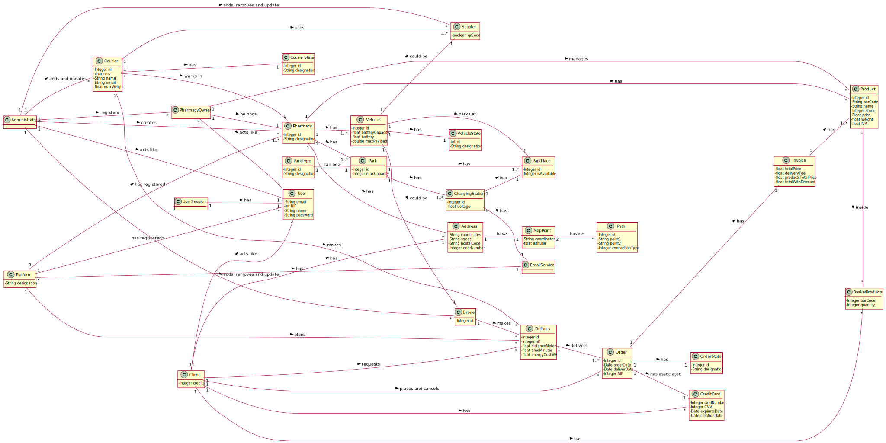

### _Categories List_ ###

**Transactions (from business)**

* Product
* Order
* Delivery

---

**Lines of transactions**

* Platform
* Invoice
* Delivery
* Drone
* Scooter

---

**Transaction-related products or services**

* EmailService

---

**Records (of transactions)**

* Invoice
* EmailService

---  

**People's roles**

* Administrator
* User
* Client
* Courier
* PharmacyOwner

---

**Places**

* MapPoint
* Pharmacy
* Park
* ParkPlace

---

**Events**

* Delivery
* EmailService

---

**Physical objects**

* Vehicle
* Drone
* Scooter
* Product

---

**Specifications and descriptions**

* PharmacyOwner
* User
* UserSession
* ChargingStation
* VehicleState
* CourierState
* MapPoint
* Path

---

**Catalogues**

* Platform
* Pharmacy
* BasketProducts

---

**Sets**

* Vehicles
* Park
* Pharmacy
* BasketProducts

---

**Elements of Sets**

* ParkPlace
* Drone
* Scooter

---

**Organizations**

* Pharmacy

---

**Other (external) systems**

* CreditCard

---

**Records (financial), work, contracts, legal documents**

* Invoice
* CreditCard

---

**Financial instruments**

* CreditCard

---

**Documents referred to/to perform tasks/**

* Invoice
* EmailService

---

## **Rational about identifying associations between classes** ##
 ___________________________________________________________________________
| Concept (A)           |  Association              |  Concept (B)          |
|:---------------------:|:-------------------------:|----------------------:|
| Platform              | has registered            | User                  |
|                       | has registered            | Pharmacy              |
|                       | plans                     | Delivery              |
|                       | has                       | EmailService          |
|-----------------------|---------------------------|-----------------------|
| Administrator         | acts like                 | User                  |
|   					| adds,removes and update   | Scooter               |
|   					| adds,removes and update   | Drone                 |
|                       | creates                   | Pharmacy              |
|                       | registers                 | PharmacyOwner         |
|-----------------------|---------------------------|-----------------------|
| UserSession           |has                        | User                  |
|-----------------------|---------------------------|-----------------------|
| Address               |has                        | MapPoint              |
|-----------------------|---------------------------|-----------------------|
| MapPoint              |have                       | Path                  |
|-----------------------|---------------------------|-----------------------|
| ChargingStation       |is a                       | ParkPlace             |
|-----------------------|---------------------------|-----------------------|
| Client                |acts like                  | User                  |
|                       |has                        | Address               |
|                       |requests                   | Delivery              |
|                       |has                        | CreditCard            |
|                       |place                      | Order                 |
|                       |has                        | BasketProducts        |
|-----------------------|---------------------------|-----------------------|
| Product               |inside                     | BasketProducts        |
|-----------------------|---------------------------|-----------------------|
| Park                  |has                        | ChargingStation       |
|                       |has                        | ParkPlace             |
|-----------------------|---------------------------|-----------------------|
| ParkType              |can be                     | Park                  |
|-----------------------|---------------------------|-----------------------|
| Pharmacy              |has                        | Park                  |
|                       |has                        | Vehicle               |
|                       |has                        | Product               |
|                       |has                        | Address               |
|-----------------------|---------------------------|-----------------------|
| Vehicle               |parks at                   | ParkPlace             |
|                       |has                        | VehicleState          |
|-----------------------|---------------------------|-----------------------|
| Courier               |uses                       | Scooter               |
|                       |makes                      | Delivery              |
|                       |works in                   | Pharmacy              |
|                       |has                        | CourierState          |
|-----------------------|---------------------------|-----------------------|
| Order                 |has                        | Invoice               |
|                       |has                        | OrderState            |
|                       |has associated             | CreditCard            |
|-----------------------|---------------------------|-----------------------|
| Delivery              |delivers                   | Order                 |
|-----------------------|---------------------------|-----------------------|
| Invoice               |has                        | Product               |
|-----------------------|---------------------------|-----------------------|
| PharmacyOwner         |manages                    | Product               |
|                       |belongs                    | Pharmacy              |
|                       |acts like                  | User                  |
|-----------------------|---------------------------|-----------------------|
| ChargingStation       |has                        | EmailService          |
|-----------------------|---------------------------|-----------------------|
| Vehicle               |could be                   | Scooter               |
|                       |could be                   | Drone                 |
|-----------------------|---------------------------|-----------------------|
| Drone                 |makes                      | Delivery              |
 ___________________________________________________________________________

## Domain Model

