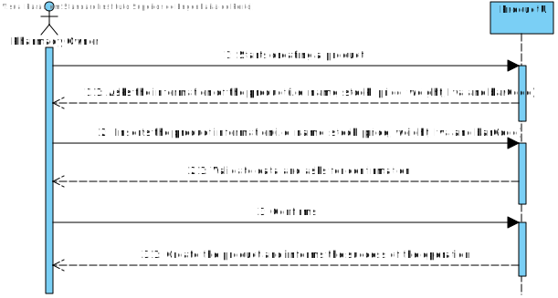
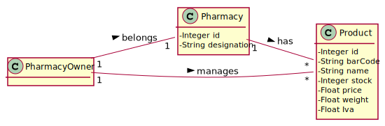
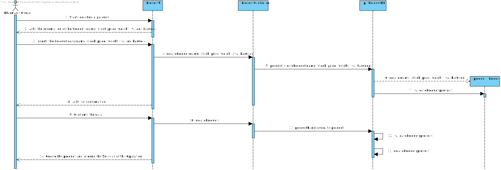
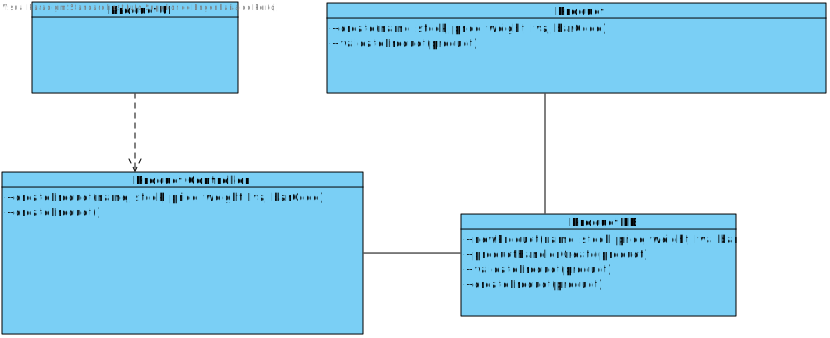
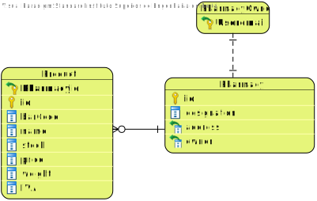

# UC11 - Create Product

## 1. Requirements Engineering

### SSD

## 2. OO Analysis

### Excerpt from the Domain Model Relevant to the UC

## 3. Design - Realization of the Use Case

### Sequence Diagram

### Class Diagram

### Excerpt from the Relational Model Relevant to the UC

---
