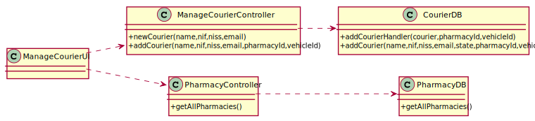

# UC18 - Add Courier

## 1. Requirements Engineering

### SSD

## 2. OO Analysis

###Domain Model 

###Relational Model

## 3. Design - Realization of the Use Case

### Sequence Diagram

### Class Diagram

---
