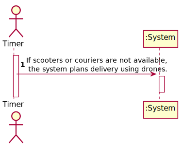
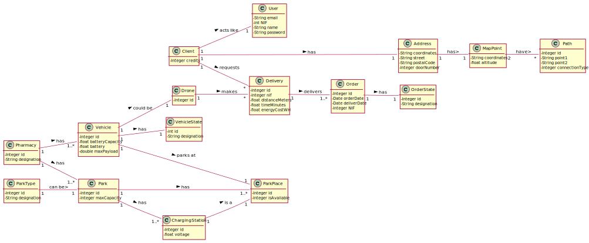
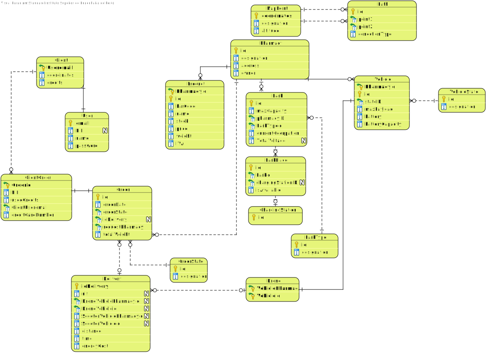
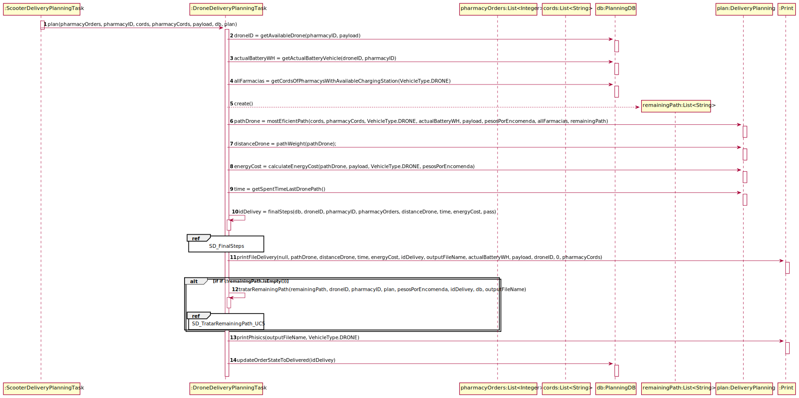
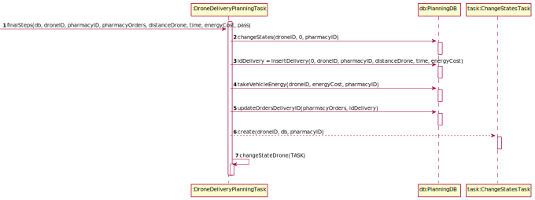
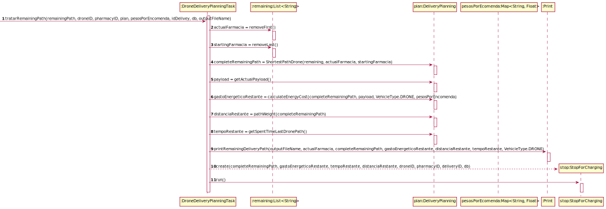
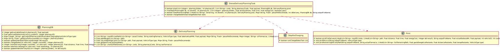

# UC29 - Drone Delivery Plan

## 1. Requirements Engineering

### SSD

## 2. OO Analysis

###Domain Model

###Relational Model

## 3. Design - Realization of the Use Case

### Sequence Diagram

### SD_FinalSteps

### SD_TratarRemainingPath_UC29

### Class Diagram

---