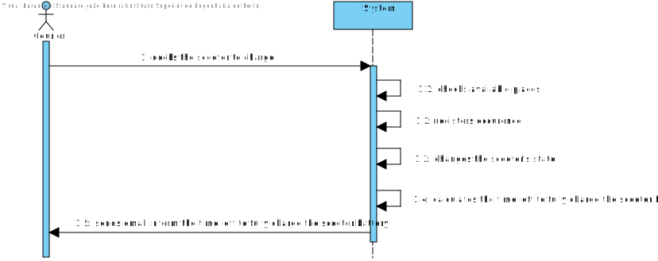
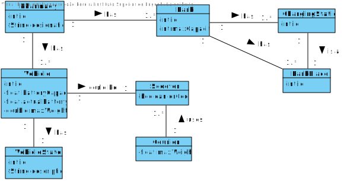
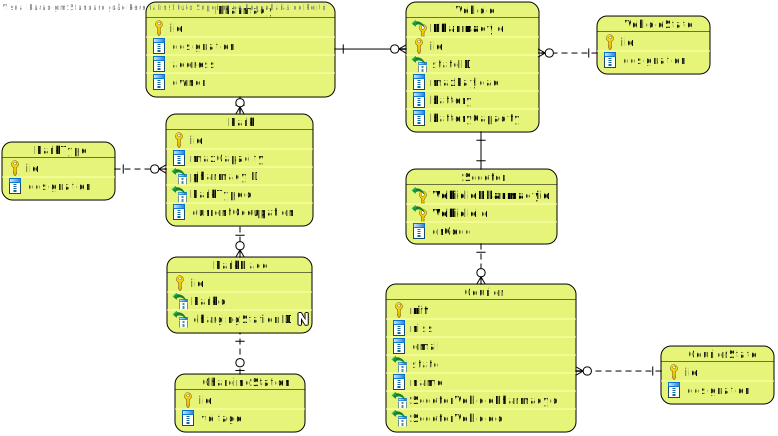
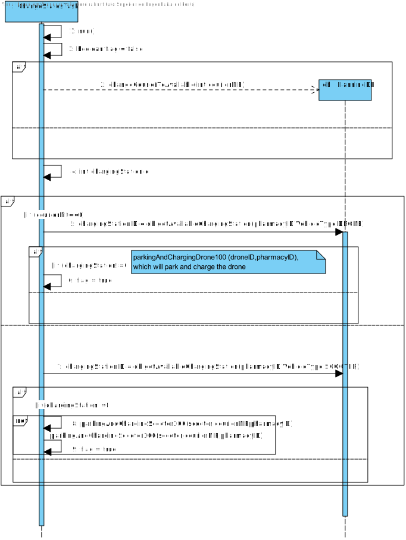
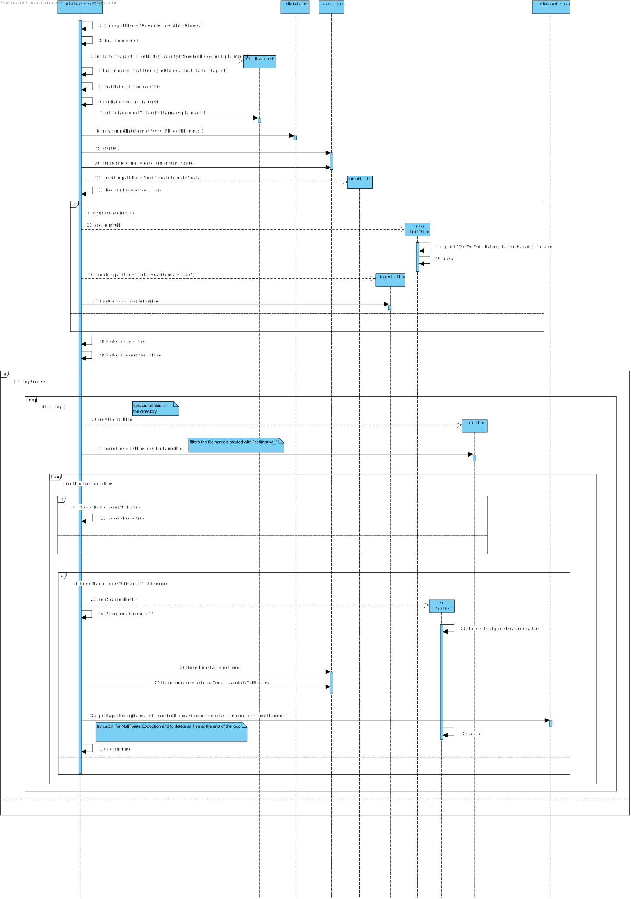
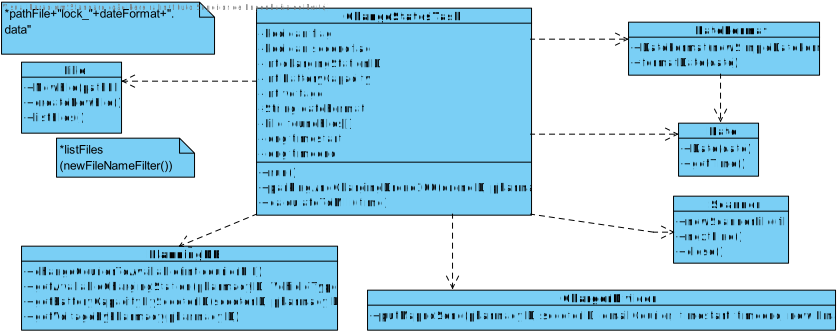

# UC40 - Scooter Parking

## 1. Requirements Engineering

### SSD

## 2. OO Analysis

### Domain Model

### Relational Model

## 3. Design - Realization of the Use Case

### Sequence Diagram

### Class Diagram

---
